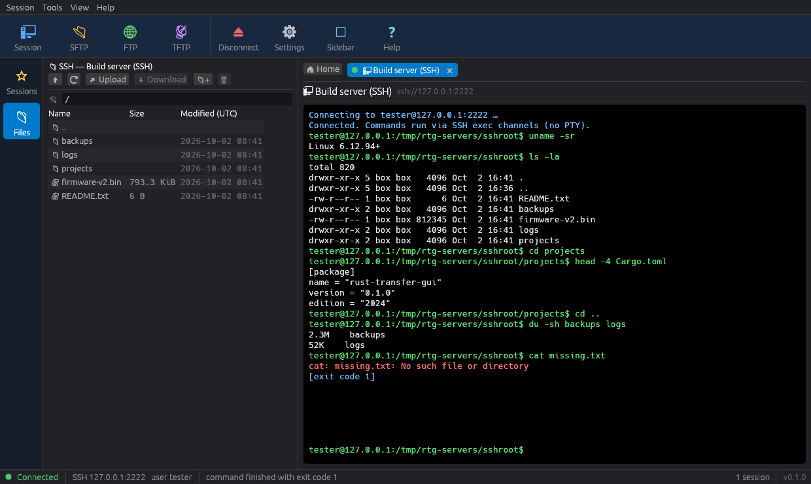
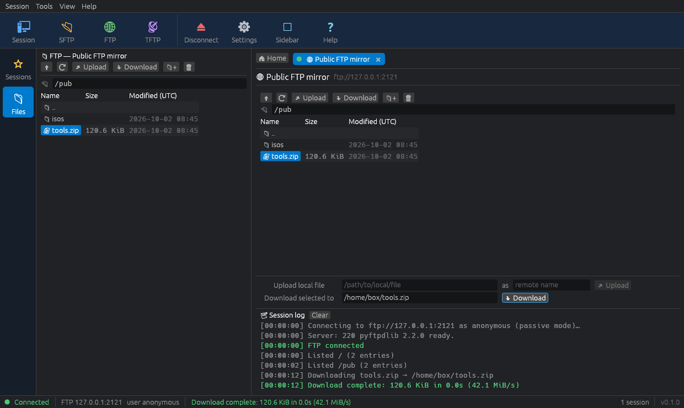

# Rust Transfer GUI

A small, fast desktop client for **FTP**, **SFTP / SSH** and **TFTP** file transfers,
written in Rust with [egui/eframe](https://github.com/emilk/egui). The layout is
inspired by classic multi-protocol terminal tools (such as MobaXterm): menu bar,
large tool-bar buttons, a collapsible sidebar with saved sessions and a remote file
browser, closable session tabs and a status bar. It is not affiliated with any of
them and uses no third-party assets.



<details>
<summary>FTP session tab (file browser, transfer form, session log)</summary>


</details>

## Features

* **Multi-session tabs** – one closable tab per connection (SSH, SFTP, FTP, TFTP) plus a
  Home tab. Status dots show connected / connecting / disconnected.
* **New-session dialog** – protocol buttons across the top (SSH, SFTP, FTP, TFTP), then host,
  port, user name and authentication fields.
* **Saved sessions** (sidebar → *Sessions*): name, protocol, host, port, user, auth method,
  key path. Double-click to connect, right-click to edit/delete.
  **Passwords and passphrases are never written to disk.**
* **SFTP / Files sidebar** – browse the remote directory of the active SSH/SFTP/FTP tab:
  name, size, modification time; up, refresh, upload, download, new folder and delete
  (with confirmation). Double-click folders to enter them.
* **SSH** (via `ssh2`/libssh2): password or private-key authentication (optional passphrase).
  Passwords also work on servers that only offer `keyboard-interactive` (the common
  OpenSSH/PAM setup); servers without an SFTP subsystem still get the terminal. Features
  a dark terminal-style panel (monospace, black background, green prompt) that runs each
  command over an SSH exec channel and shows stdout, stderr (red) and non-zero exit codes.
  `cd` is emulated so the working directory persists between commands; ↑/↓ history,
  `clear`. (This is not a full PTY terminal emulator; interactive programs such as `vim`
  or `top` will not work.)
* **SFTP** – full file browser in the tab plus a text-path upload/download form.
* **FTP** (via `suppaftp`): passive (PASV) or active mode, directory navigation, upload,
  download, mkdir, delete. Plain FTP only (no FTPS).
* **TFTP** – a built-in RFC 1350 client (`src/tftp.rs`): RRQ/WRQ, 512-byte DATA/ACK, ERROR
  packets, timeouts with retransmission, transfer-ID checking, block-number wraparound
  (files > 32 MiB), octet mode.
* **Never blocks the UI** – every network operation runs on a background thread and reports
  back through channels; progress bars and per-session logs; network errors are reported,
  never panicking.
* Dark theme with blue accents (light theme available under *View*).

## Download / install

### Windows installer

Every `v*` tag builds `rust-transfer-gui-<version>-x64-setup.exe` (and a portable `.exe`)
via GitHub Actions (`.github/workflows/release.yml`); they are attached to the GitHub
Release and also available as workflow artifacts. The installer:

* installs `rust-transfer-gui.exe` to `C:\Program Files\Rust Transfer GUI`,
* creates Start Menu shortcuts and, optionally, a desktop shortcut,
* adds the install folder to the **system PATH** (component *Add to system PATH*, on by
  default; duplicates are avoided, `%VARIABLES%` in the existing PATH are preserved and the
  change is broadcast so new terminals see it immediately),
* registers an uninstaller (*Settings → Apps*), which removes the files, shortcuts and the
  PATH entry again.

After installing, you can start the app from any new terminal with `rust-transfer-gui`.
Silent install/uninstall: `rust-transfer-gui-0.1.1-x64-setup.exe /S` and
`"C:\Program Files\Rust Transfer GUI\uninstall.exe" /S`.

To build the installer yourself (requires [NSIS 3](https://nsis.sourceforge.io/)):

```powershell
cargo build --release --target x86_64-pc-windows-msvc
mkdir dist
makensis /DVERSION=0.1.0 installer\windows\rust-transfer-gui.nsi
# -> dist\rust-transfer-gui-0.1.1-x64-setup.exe
```

The PATH changes are done by `installer/windows/path-helper.ps1` (run elevated by the
installer through Windows PowerShell).

## Building from source

Requires a recent stable Rust toolchain (edition 2024, Rust ≥ 1.95; install via
[rustup](https://rustup.rs/)) and a C compiler (libssh2 and OpenSSL are compiled from
source and linked statically, so no system OpenSSL is needed at run time; building
OpenSSL needs `perl` and `make`).

```bash
cargo build --release
./target/release/rust-transfer-gui
```

### Linux system dependencies

Debian / Ubuntu:

```bash
sudo apt-get install build-essential perl pkg-config libssl-dev libgtk-3-dev \
    libxcb-render0-dev libxcb-shape0-dev libxcb-xfixes0-dev libxkbcommon-dev libgl1-mesa-dev
```

At run time the app needs an OpenGL driver (Mesa is fine), GTK 3 (for the native file
dialogs) and `libxkbcommon-x11` (`libxkbcommon-x11-0` on Debian/Ubuntu); all are present on
normal desktop installs. Fedora: `gtk3-devel libxkbcommon-devel mesa-libGL-devel perl`.

### Windows / macOS

No extra dependencies besides the Rust toolchain (on Windows: the MSVC build tools, and
Strawberry Perl for the vendored OpenSSL build — it is preinstalled on GitHub runners).

## Usage

1. Click **Session** (or **SFTP / FTP / TFTP**) in the tool bar, or press **Ctrl+N**.
2. Pick the protocol at the top of the dialog, enter host, port, user and password /
   key file, optionally give the session a name and keep *Save in the Sessions list*
   checked. Press **OK**.
3. **SSH tab**: type commands at the green prompt and press Enter. Open the **Files** tab of
   the sidebar to browse, upload and download over SFTP on the same connection.
4. **SFTP / FTP tab**: double-click folders, select a file and use *Download*, or *Upload*
   to send a local file into the current folder (file dialog or the text-path form).
5. **TFTP tab**: enter the remote file name and a local path, then **Get** or **Put**.
6. Saved sessions appear in the sidebar; double-click to reconnect (you will be asked
   for the password, which is never stored).

Saved sessions and settings live in a small text file (no secrets):
`~/.config/rust-transfer-gui/sessions.conf` (Linux), `~/Library/Application Support/rust-transfer-gui/sessions.conf`
(macOS), `%APPDATA%\rust-transfer-gui\sessions.conf` (Windows). Override with the
`RUST_TRANSFER_GUI_CONFIG` environment variable.

## Binary size

The release profile is tuned for size (`opt-level = "s"`, which measured slightly smaller than `"z"` for this app; fat LTO, `codegen-units = 1`,
`panic = "abort"`, stripped) and dependencies are trimmed (glow/OpenGL renderer instead of
wgpu, no AccessKit integration, GTK3 file dialogs instead of the xdg-portal/zbus stack, FTP without TLS
backends, no async runtime).

| target | default features + default release profile | optimised |
|---|---|---|
| Linux x86_64 | 34.5 MiB | **12.4 MiB** |
| Windows x86_64 (GNU, cross-built) | 41.3 MiB | **10.8 MiB** (installer: ~3.9 MiB) |

According to `cargo bloat`, the largest remaining pieces are egui's font rasteriser
(`vello_cpu`, ~1.5 MiB of code) and the statically linked OpenSSL (~1.4 MiB).
Optionally you can compress the executable further with [UPX](https://upx.github.io/)
(`upx --best --lzma target/release/rust-transfer-gui`); this is not required and some
antivirus products flag UPX-packed executables, so release builds are not packed.

## Project layout

```
src/
  main.rs          entry point (no console window on Windows release builds)
  lib.rs           library root (back-ends are usable without the GUI)
  common.rs        shared types/helpers (listing entries, progress copy, formatting)
  config.rs        saved sessions + settings file (never contains passwords)
  ftp.rs           FTP back-end (suppaftp)
  sftp.rs          SSH/SFTP back-end (ssh2): browse, transfer, exec
  tftp.rs          RFC 1350 TFTP client over UdpSocket + unit/loopback tests
  worker.rs        background threads, command/event channels
  app/             egui front-end: mod.rs (menus, tool bar, tabs, status bar),
                   dialog.rs, sidebar.rs, files.rs, terminal.rs, session.rs, theme.rs, widgets.rs
tests/integration.rs        end-to-end tests against real servers (#[ignore])
scripts/test-servers/       throw-away local FTP/SSH/TFTP servers for those tests
installer/windows/          NSIS installer + PATH helper
vendor/libssh2-sys/         libssh2-sys 0.3.3 with a backported heap-overflow fix
```

## Testing

```bash
cargo test                      # unit tests (TFTP codec + loopback transfers, config, parsing…)
cargo test --lib -- --ignored   # slow TFTP block-number wraparound test (~33 MiB)
cargo clippy --all-targets
```

End-to-end tests against real servers (FTP: pyftpdlib, SSH/SFTP: AsyncSSH **and real OpenSSH
`sshd`** – password, keyboard-interactive-only, no-SFTP and strict-algorithm configurations –,
TFTP: tftpy) are described in [`scripts/test-servers/README.md`](scripts/test-servers/README.md)
and run in CI.

## Troubleshooting SSH connections

The session log (and the SSH terminal) shows every connection stage, e.g.

```text
TCP connected to 192.168.1.10:22
Server software: SSH-2.0-OpenSSH_9.6p1 Ubuntu-3ubuntu13.5
Negotiated: kex curve25519-sha256, host key ecdsa-sha2-nistp256, cipher chacha20-poly1305@openssh.com, mac implicit (AEAD)
Server offers authentication methods: publickey,keyboard-interactive
Server does not offer "password"; using "keyboard-interactive" with the password
Authenticated with method "keyboard-interactive"
```

Errors start with the stage that failed – `DNS:`, `TCP:`, `SSH handshake:`, `Auth:` – and
include the libssh2 error name/code, the authentication methods the server offers and a hint
(e.g. "nothing is listening on that port", "no common algorithm", "the server does not allow
password logins (it offers: publickey)"). PuTTY `.ppk` keys are not supported: export them
from PuTTYgen as an OpenSSH key.

## Limitations

* The SSH host key is **not** checked against `known_hosts`; its SHA-256 fingerprint is
  shown in the session log instead.
* The SSH terminal is line-based (exec channel per command), not a PTY emulator, and the
  `cd` emulation assumes a POSIX shell on the server.
* FTP is plain text (no FTPS); TFTP has no option negotiation (blksize/tsize).
* Only one transfer at a time per session (requests are queued); there is no cancel button.
* `vendor/libssh2-sys` carries a one-line backport of an upstream libssh2 fix (heap overflow
  when a server advertises duplicate `server-sig-algs`); see `vendor/libssh2-sys/PATCHED.md`.

## License

[MIT](LICENSE) © 2026 Ke Sheng Da

---

## 繁體中文說明

**Rust Transfer GUI** 是以 Rust 與 egui 撰寫的桌面檔案傳輸工具，支援 **FTP**、**SFTP / SSH** 與 **TFTP**。
介面參考 MobaXterm 等多協定終端工具的配置（僅為風格參考，未使用其任何素材或商標）：

* 上方選單列（Session、Tools、View、Help）與大型圖示工具列（Session、SFTP、FTP、TFTP、Disconnect、Settings）。
* 左側可收合側邊欄：「Sessions」儲存的連線清單（**不會儲存密碼**）與「Files」遠端檔案瀏覽（上一層、重新整理、上傳、下載、新增資料夾、刪除）。
* 主畫面為多分頁，每個連線一個分頁；SSH 分頁提供黑底綠字的終端機風格面板，可執行遠端指令並顯示 stdout / stderr / 結束碼（非完整 PTY）。
* TFTP 為自行實作的 RFC 1350 用戶端（逾時重傳、區塊編號循環、錯誤封包處理）。
* 所有網路作業都在背景執行緒進行，介面不會卡住；下方狀態列顯示連線狀態與傳輸進度。

**建置：** 安裝 Rust 後執行 `cargo build --release`，執行檔位於 `target/release/rust-transfer-gui`。
Linux 需先安裝：`build-essential perl pkg-config libssl-dev libgtk-3-dev libxcb-render0-dev libxcb-shape0-dev libxcb-xfixes0-dev libxkbcommon-dev libgl1-mesa-dev`。

**Windows 安裝程式：** 推送 `v*` 標籤時，GitHub Actions 會產生 `rust-transfer-gui-<版本>-x64-setup.exe`。
安裝程式會安裝到 `C:\Program Files\Rust Transfer GUI`、建立開始功能表捷徑（桌面捷徑可選），
並（預設）將安裝目錄加入**系統 PATH**（避免重複、保留既有的 `%變數%`，並廣播環境變數變更）；
解除安裝時會一併移除 PATH 項目。安裝後即可在新的終端機輸入 `rust-transfer-gui` 啟動。

**SSH 連線問題：** 工作階段記錄會列出每個連線階段（TCP、伺服器版本、協商的演算法、伺服器提供的驗證方式）。
錯誤訊息以失敗階段開頭（`DNS:`、`TCP:`、`SSH handshake:`、`Auth:`），並附上 libssh2 錯誤碼與提示。
伺服器只提供 `keyboard-interactive`（常見的 OpenSSH + PAM 設定）時，會自動改用 keyboard-interactive 送出密碼；
沒有 SFTP 子系統的伺服器仍可使用終端機。PuTTY `.ppk` 金鑰需先在 PuTTYgen 匯出為 OpenSSH 格式。

**使用：** 按工具列的「Session」（或 Ctrl+N），在對話框上方選擇協定，輸入主機、連接埠、帳號與密碼／金鑰後按 OK。
儲存的連線設定位於 `~/.config/rust-transfer-gui/sessions.conf`（Windows 為 `%APPDATA%\rust-transfer-gui\sessions.conf`），其中不含任何密碼。

授權：MIT © 2026 Ke Sheng Da
